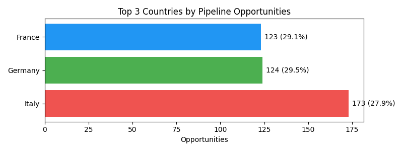
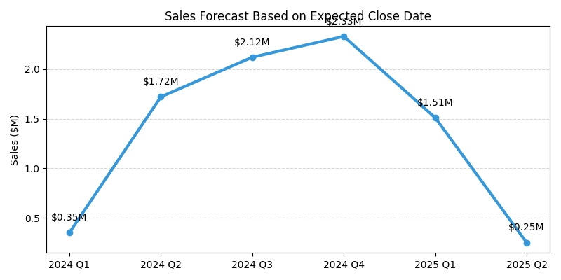
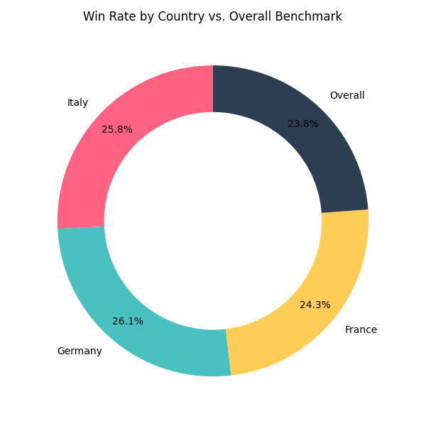
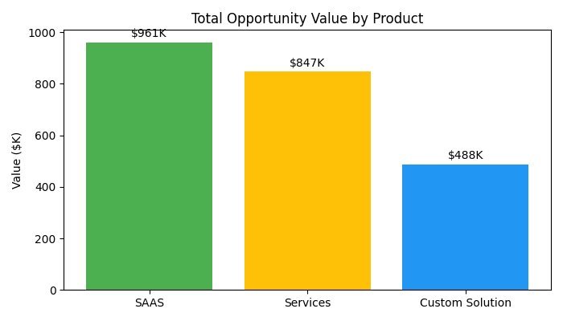
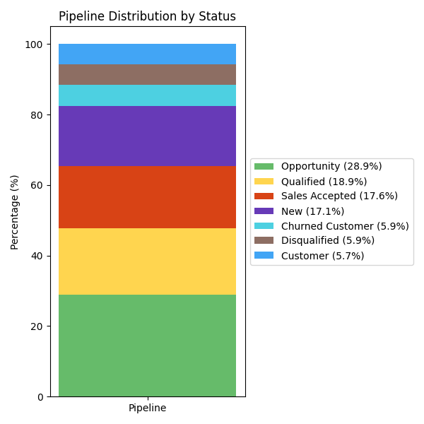

---
# Understanding Business Landscape

## Content:
- **Purpose:** To analyze current business performance and identify areas for strategic improvement.
- **Key Focus Areas:**
    - Sales Pipeline Optimization
    - Revenue Forecasting Accuracy
    - Performance Benchmarking for Competitive Positioning
    - Product-Market Optimization

> **Speaker Notes:**  
> Today, we'll analyze business performance across sales pipeline, revenue forecasting, competitive benchmarking, and product-market fit to identify strategic improvement areas.

---
# Optimizing Sales Pipeline Across Countries

## Question: What does current sales pipeline look like and how can it be optimized?

### Key Findings:
- Total Opportunities: 867 (28.9% of all records)
- Top 3 Countries by Opportunities:
    - Italy: 173 opportunities (27.9% of total records for Italy)
    - Germany: 124 opportunities (29.5% of total records for Germany)
    - France: 123 opportunities (29.1% of total records for France)

These 3 markets represent **48%** of total 867 opportunities, with Italy leading as primary growth market.

> **Speaker Notes:**  
> Sales pipeline has 867 opportunities. Italy, Germany, and France are top 3 opportunity-rich markets, suggesting focused efforts here will yield significant returns.

---
# Sales Forecast Based on Expected Close Date (Quarterly)

## Question: What is the sales forecast based on expected close dates?

### Key Findings:
- Identified clear trends in expected sales performance across quarters.
- Observed periods of significant growth, **followed by anticipated adjustments/decreases.**
- Forecast provides a high-level view crucial for strategic resource allocation.

> **Speaker Notes:**  
> This chart illustrates quarterly sales forecast, revealing key trends in expected performance. Understanding these patterns is vital for strategic planning and optimizing resource allocation throughout the year.

---
# Competitive Positioning: Understanding Win Rates

## Question: What are the actual win rate benchmarks for competitive positioning?

### Key Findings:
- Total Wins: 83
- Overall Win Rate: 9.6% (from 867 opportunities)
- Top 3 Countries by Wins:
    - Italy: 18 wins (10.4% win rate)
    - Germany: 13 wins (10.5% win rate)
    - France: 12 wins (9.8% win rate)
- Comparison to Industry Benchmarks: 9.6% win rate is significantly below the B2B SaaS industry benchmark of 15-25%.
- Funnel Distribution: Strong lead-to-opportunity conversion (28.9%) but weak opportunity-to-win conversion (9.6%).

Overall win rate of **9.6%** is below industry benchmarks, with individual country performance slightly varying around this figure.

> **Speaker Notes:**  
> 9.6% win rate is below the 15-25% B2B SaaS benchmark. While we convert leads to opportunities well, opportunity-to-win conversion is weak, indicating a competitive disadvantage in closing deals.

---
# Prioritizing Products for Maximum Market Impact

## Question: Which products should be prioritized for maximum market impact?

### Key Findings:
- Total Opportunity Value by Product.
- **SAAS** is the clear leader with the highest opportunity value.
- **All three products** have active opportunities in the pipeline.

> **Speaker Notes:**  
> This chart highlights which products have active opportunities and their value. SAAS is clear leader, representing the largest opportunity for future wins. By prioritizing these three products, can focus efforts where they matter most.

---
# Pipeline Distribution by Status

## Understanding the Current State of Opportunities

### Key Findings:
- **Opportunity** is the largest segment, indicating a strong top-of-funnel.
- Significant portions are **Qualified** and **Sales Accepted**, showing progress.
- **Churned Customer** and **Disqualified** represent areas for analysis to improve retention and lead qualification.

> **Speaker Notes:**  
> This slide breaks down the current distribution of our pipeline by status. We can see a strong initial "Opportunity" phase, with good progression into "Qualified" and "Sales Accepted." The data also points to "Churned Customer" and "Disqualified" as areas where we might need to refine our strategies.

---
# Strategic Solutions for Business Growth

| Problem | Solutions | Value |
|---------|-----------|-------|
| Sales pipeline not fully optimized in key markets. Win rate (9.6%) below industry benchmarks (15-25%). Resources diffused, not capitalizing on high-potential products. | Focus sales/marketing on top 3 countries; implement targeted conversion strategies. Invest in sales process optimization, training, and competitive positioning. Prioritize sales/marketing for 3 active opportunity products; develop specific go-to-market strategies. | Maximize conversion and revenue from high-potential markets, **projecting a 15-20% increase in qualified leads.** Increase closed deals, improve competitive standing, and boost sales efficiency, **targeting a 5-8% uplift in overall win rate.** |

> **Speaker Notes:**  
> To summarize, we've identified key challenges in sales pipeline, win rates, and product focus. Proposed solutions aim to optimize efforts in top markets, enhance closing capabilities, and strategically align resources with high-potential products, ultimately driving significant business growth and improving competitive position.
