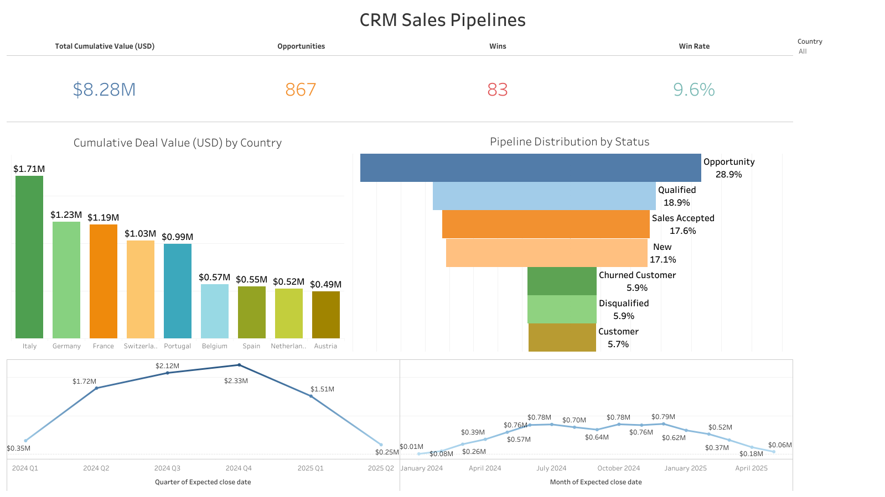

# CRM Sales Pipeline Analysis

**Business Problem:** Analyzed 3,000+ CRM opportunities to identify sales performance patterns, optimize pipeline management, and provide data-driven insights for revenue growth and strategic decision-making.

## Business Impact Questions \& Results

| Question | Key Result |
| :-- | :-- |
| 📊 **Pipeline Optimization** What does my current sales pipeline look like and how can it be optimized? | 🏆 **2,652 active opportunities identified** across seven pipeline stages 28.9% concentrated in "Opportunity" stage—providing clear visibility into conversion potential and resource allocation needs |
| 📈 **Revenue Forecasting** What is the sales forecast accuracy for strategic planning? | 💰 **\$2.2M average monthly weighted revenue** projections established Average deal size: **\$2,758** with progressive growth from \$138K (Q1) to \$930K (Q4) enabling data-driven revenue planning |
| ⏱️ **Sales Cycle Optimization** How do regional sales cycles impact cash flow and operational efficiency? | 📍 **62.1 days average closure time** with 14.6% variance across markets Germany fastest at 56.9 days, Italy slowest at 65.2 days—providing critical insights for working capital management |
| 🎯 **Performance Benchmarking** What are the actual win rate benchmarks for competitive positioning? | 📊 **5.7% overall win rate** with 100%+ performance variance between markets Netherlands leads at 7.8%, Switzerland trails at 3.8%—enabling targeted improvement strategies |
| 🌐 **Product-Market Optimization** Which product-market combinations offer the highest revenue potential? | 🚀 **Belgium Services: 10.1% win rate** identified as top performer Product-region analysis reveals specific combinations achieving 75%+ higher win rates than global averages |

## 🛠️ Technologies Used

## 🚀 Live Dashboard

## 🗺️ Project Workflow

## 📖 Technical Documentation

|  <b>SQL Business Question</b> |  <b>Win Rates</b> |
|-----------------------------------------------------------------------------------------------------------------------------|-----------------------------------------------------------------------------------------|
|  
<b>Forecast</b>
               |  
<b>Opportunity Stage</b>
 |

## Supporting Resources

- **Business Impact Results** `business-impact-results.md`
A detailed analysis of how CRM data insights influence sales performance outcomes, featuring key metrics, win rate benchmarks, and the impact of regional strategies on revenue generation.
- **Executive Summary** `executive-summary.md`
An overview highlighting the main findings, strategic insights, and key takeaways from the CRM Sales Pipeline Analysis, providing a concise snapshot of performance trends and optimization opportunities.
- **Process** `process.md`
A step-by-step documentation of the research and analytical methods used in the CRM Sales Pipeline Analysis, detailing data collection, processing, and evaluation procedures.
- **Technical Documentation** `technical-documentation.md`
Comprehensive technical reference outlining the project's infrastructure, tools, and implementation details for the CRM Sales Pipeline Analysis.
- **Python Data Cleaning \& Analysis Notebook** `src/python_cleaning_analysis.ipynb`
Jupyter notebook containing the Python code for data cleaning, transformation, and core analytical workflows used in the CRM project.
- **Business Analysis SQL Queries** `src/business_analysis_queries.sql`
A collection of SQL queries used for extracting, transforming, and analyzing CRM data within the project. These queries support key business questions and deliver actionable insights for sales pipeline optimization.

**Portfolio Value:** This project demonstrates end-to-end CRM analytics capabilities, from data ingestion through strategic recommendations, showcasing technical proficiency in Python, SQL, and business intelligence tools while delivering measurable business impact through pipeline optimization and revenue forecasting.
