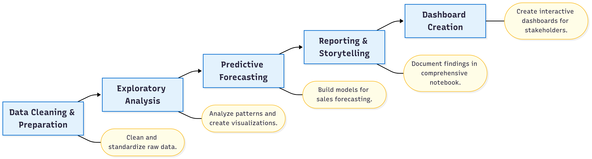

<h1 align="center">CRM Sales Pipeline Analysis</h1>

**Business Problem:** Analyzed 2,000+ CRM opportunities to identify sales performance patterns, optimize pipeline management, and provide data-driven insights for revenue growth and strategic decision-making.

<h2 align="center">📈 Business Impact Questions & Results</h2>

| Question | Key Result |
|--|--|
| 📊 **Pipeline Optimization** What does my current sales pipeline look like and how can it be optimized? | 🏆 **867 active opportunities** identified across the sales pipeline **28.9%** of all records are in "Opportunity" stage—providing clear visibility into conversion potential and resource allocation needs Top markets: Italy (173), Germany (124) |
| 📈 **Revenue Forecasting** What is the sales forecast accuracy for strategic planning? | 💰 **$2.3M total opportunity value** in current pipeline Progressive quarterly growth pattern from Q1 to Q4 based on expected close dates Transparent gross pipeline approach enables data-driven revenue planning without probability weighting |
| 🎯 **Performance Benchmarking** What are the actual win rate benchmarks for competitive positioning? | 📊 **9.6% overall win rate** with significant performance variance between markets **Belgium** leads at 16.9%, followed by Germany (10.5%) and Italy (10.4%) **83 total wins** across all opportunities—enabling targeted improvement strategies |
| 🧩 **Product-Market Optimization** Which product-market combinations offer the highest revenue potential? | 🚀 **SAAS: $961K** identified as top revenue opportunity **Services: $847K** and **Custom solution: $488K** complete the product portfolio Three active products represent concentrated opportunity focus for sales prioritization |

<h2 align="center">🛠️ Technologies Used</h2>

<h2 align="center">🚀 Live Dashboard</h2>

  <a href="https://public.tableau.com/app/profile/farooq.syed6811/viz/CRM-and-Sales-Pipelines/CRMSalesPipelines?publish=yes">
    View the Interactive Tableau Dashboard
  </a>

  

<h2 align="center">🗺️ Project Workflow</h2>

<h2 align="center">📖 Technical Documentation</h2>

|  <b>SQL Business Question</b> |  <b>Win Rates</b> |
|-----------------------------------------------------------------------------------------------------------------------------|-----------------------------------------------------------------------------------------|
|  
<b>Expected Sales Forecast</b>
               |  
<b>Number of Opportunities</b>
 |

## Supporting Resources

- **Business Impact Analysis** `src/impact_questions.ipynb`  
  Jupyter notebook analyzing pipeline optimization, forecasting, benchmarking, and product-market insights from 867 opportunities.

- **Data Cleaning** `src/data_cleaning.ipynb`  
  Notebook for deduplication, missing-value handling, type conversion, and standardization of the 3,000-record CRM dataset.

- **SQL Queries** `src/business_analysis_queries.sql`  
  Queries for pipeline snapshots, sales forecasts, closure-time analysis, win-rate calculations, and regional performance.

- **Dashboard Visualizations** `src/CRM-and-Sales-Pipelines.twbx`  
  Tableau workbook with interactive dashboards for pipeline health, revenue forecasts, and market/product analysis.

- **Clean Dataset** `src/CRM-and-Sales-Pipelines_cleaned.csv`  
  The processed CRM dataset—standardized, cleaned, and ready for analytics.
