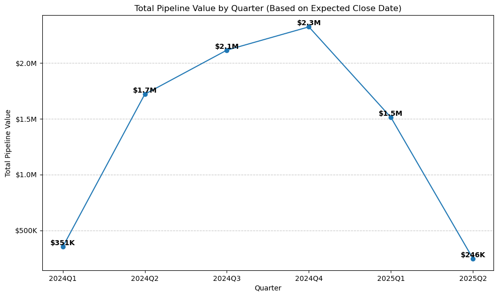

```python
import pandas as pd
df = pd.read_csv('CRM-and-Sales-Pipelines_cleaned.csv')
df.head()

```


<div>
<style scoped>
    .dataframe tbody tr th:only-of-type {
        vertical-align: middle;
    }

    .dataframe tbody tr th {
        vertical-align: top;
    }

    .dataframe thead th {
        text-align: right;
    }
</style>
<table border="1" class="dataframe">
  <thead>
    <tr style="text-align: right;">
      <th></th>
      <th>Organization</th>
      <th>Country</th>
      <th>Latitude</th>
      <th>Longitude</th>
      <th>Industry</th>
      <th>Organization_size</th>
      <th>Owner</th>
      <th>Lead_acquisition_date</th>
      <th>Product</th>
      <th>Status</th>
      <th>Status_sequence</th>
      <th>Stage</th>
      <th>Stage_sequence</th>
      <th>Deal_Value_USD</th>
      <th>Probability_Pct</th>
      <th>Expected_close_date</th>
      <th>Actual_close_date</th>
    </tr>
  </thead>
  <tbody>
    <tr>
      <th>0</th>
      <td>Thoughtblab</td>
      <td>Netherlands</td>
      <td>52.370216</td>
      <td>4.895168</td>
      <td>Banking and Finance</td>
      <td>Small (11-200)</td>
      <td>John Smith</td>
      <td>4/20/2024</td>
      <td>SAAS</td>
      <td>Churned Customer</td>
      <td>7</td>
      <td>NaN</td>
      <td>NaN</td>
      <td>833</td>
      <td>90</td>
      <td>8/7/2024</td>
      <td>6/27/2024</td>
    </tr>
    <tr>
      <th>1</th>
      <td>Jaxnation</td>
      <td>Spain</td>
      <td>40.416775</td>
      <td>-3.703790</td>
      <td>Energy &amp; Utilities</td>
      <td>Small (11-200)</td>
      <td>Emily Johnson</td>
      <td>5/28/2024</td>
      <td>SAAS</td>
      <td>Churned Customer</td>
      <td>7</td>
      <td>NaN</td>
      <td>NaN</td>
      <td>1623</td>
      <td>30</td>
      <td>10/25/2024</td>
      <td>9/11/2024</td>
    </tr>
    <tr>
      <th>2</th>
      <td>Mybuzz</td>
      <td>Italy</td>
      <td>41.902782</td>
      <td>12.496366</td>
      <td>Education &amp; Science</td>
      <td>Small (11-200)</td>
      <td>Michael Brown</td>
      <td>3/17/2024</td>
      <td>SAAS</td>
      <td>Churned Customer</td>
      <td>7</td>
      <td>NaN</td>
      <td>NaN</td>
      <td>1928</td>
      <td>20</td>
      <td>3/17/2025</td>
      <td>5/11/2024</td>
    </tr>
    <tr>
      <th>3</th>
      <td>Kare</td>
      <td>Germany</td>
      <td>52.520008</td>
      <td>13.404954</td>
      <td>Government Administration Healthcare</td>
      <td>Small (11-200)</td>
      <td>Michael Brown</td>
      <td>1/18/2024</td>
      <td>SAAS</td>
      <td>Churned Customer</td>
      <td>7</td>
      <td>NaN</td>
      <td>NaN</td>
      <td>303</td>
      <td>50</td>
      <td>8/7/2024</td>
      <td>5/6/2024</td>
    </tr>
    <tr>
      <th>4</th>
      <td>Skaboo</td>
      <td>Germany</td>
      <td>52.520008</td>
      <td>13.404954</td>
      <td>Energy &amp; Utilities</td>
      <td>Small (11-200)</td>
      <td>Michael Brown</td>
      <td>4/6/2024</td>
      <td>SAAS</td>
      <td>Churned Customer</td>
      <td>7</td>
      <td>NaN</td>
      <td>NaN</td>
      <td>1911</td>
      <td>30</td>
      <td>10/11/2024</td>
      <td>7/25/2024</td>
    </tr>
  </tbody>
</table>
</div>


## Pipeline Optimization

**Question:**  
What does my current sales pipeline look like and how can it be optimized?

**Approach:**  
To answer this, we analyzed the sales pipeline data by focusing on records where the `Status` is "Opportunity". For each country, we calculated:
- The total number of opportunities (i.e., deals currently in the "Opportunity" stage)
- The percentage of opportunities relative to all records for that country (i.e., opportunities divided by the total number of records for that country, across all stages)

We then highlighted the top 3 countries with the highest percentage of opportunities. This helps identify markets where the sales pipeline is most opportunity-rich relative to overall activity, which can inform targeted optimization efforts.


```python
import pandas as pd
from IPython.display import display, HTML

# Count total records for each country (all stages)
total_by_country = df['Country'].value_counts().reset_index()
total_by_country.columns = ['Country', 'Total_Records']

# Count opportunities for each country
opps_by_country = df[df['Status'] == 'Opportunity']['Country'].value_counts().reset_index()
opps_by_country.columns = ['Country', 'Opportunities']

# Merge the two DataFrames
merged = pd.merge(opps_by_country, total_by_country, on='Country')

# Calculate percentage and format as '29.1%'
merged['Percentage'] = (merged['Opportunities'] / merged['Total_Records']) * 100
merged['Percentage'] = merged['Percentage'].map('{:.1f}%'.format)

# Keep only necessary columns
final = merged[['Country', 'Opportunities', 'Percentage']]

# Sort by percentage descending and get top 3
final = final.sort_values('Percentage', ascending=False).head(3).reset_index(drop=True)

# Center all columns
styles = [
    {'selector': 'th', 'props': [('text-align', 'center')]},
    {'selector': 'td', 'props': [('text-align', 'center')]}
]

display(HTML(final.style.set_table_styles(styles).hide(axis='index').to_html()))
```


<style type="text/css">
#T_65c05 th {
  text-align: center;
}
#T_65c05 td {
  text-align: center;
}
</style>
<table id="T_65c05">
  <thead>
    <tr>
      <th id="T_65c05_level0_col0" class="col_heading level0 col0" >Country</th>
      <th id="T_65c05_level0_col1" class="col_heading level0 col1" >Opportunities</th>
      <th id="T_65c05_level0_col2" class="col_heading level0 col2" >Percentage</th>
    </tr>
  </thead>
  <tbody>
    <tr>
      <td id="T_65c05_row0_col0" class="data row0 col0" >Belgium</td>
      <td id="T_65c05_row0_col1" class="data row0 col1" >65</td>
      <td id="T_65c05_row0_col2" class="data row0 col2" >31.4%</td>
    </tr>
    <tr>
      <td id="T_65c05_row1_col0" class="data row1 col0" >Netherlands</td>
      <td id="T_65c05_row1_col1" class="data row1 col1" >56</td>
      <td id="T_65c05_row1_col2" class="data row1 col2" >31.1%</td>
    </tr>
    <tr>
      <td id="T_65c05_row2_col0" class="data row2 col0" >Germany</td>
      <td id="T_65c05_row2_col1" class="data row2 col1" >124</td>
      <td id="T_65c05_row2_col2" class="data row2 col2" >29.5%</td>
    </tr>
  </tbody>
</table>


## Revenue Forecasting

**Question:**  
What is the sales forecast accuracy for strategic planning?

**Approach:**  
To provide a clear and objective view of the sales pipeline for strategic planning, I analyzed the total value of all deals expected to close in each quarter. This analysis uses only the `Deal_Value_USD` and the `Expected_close_date` columns from the CRM data, grouping deals by the quarter of their expected close date.

I chose not to use probability-weighted values (`Probability_Pct`) in this forecast. Probability estimates can vary significantly between deals and sales representatives, introducing subjectivity and potential inconsistency. By focusing on the gross pipeline value, this approach offers a transparent and easily interpretable view of the sales pipeline, which is especially useful for high-level business planning and communication.

The resulting line graph visualizes the total pipeline value by quarter, with all values formatted in business-friendly currency (e.g., $12K, $1M).


```python
import matplotlib.pyplot as plt
import matplotlib.ticker as mtick

# Ensure date is parsed and quarter is extracted
df['Expected_close_date'] = pd.to_datetime(df['Expected_close_date'], errors='coerce')
df['Quarter'] = df['Expected_close_date'].dt.to_period('Q')

# Group by quarter and sum deal value
gross_by_quarter = df.groupby('Quarter')['Deal_Value_USD'].sum().reset_index()
gross_by_quarter['Quarter'] = gross_by_quarter['Quarter'].astype(str)

# Function to format currency in $12K, $1M, etc.
def currency_format(x, pos):
    if x >= 1_000_000:
        return f'${x/1_000_000:.1f}M'
    elif x >= 1_000:
        return f'${x/1_000:.0f}K'
    else:
        return f'${x:,.0f}'

plt.figure(figsize=(10, 6))
plt.plot(gross_by_quarter['Quarter'], gross_by_quarter['Deal_Value_USD'], marker='o', label='Total Pipeline Value')

# Annotate each point with formatted value
for i, v in enumerate(gross_by_quarter['Deal_Value_USD']):
    plt.text(i, v, currency_format(v, None), ha='center', va='bottom', fontsize=10, fontweight='bold')

plt.title('Total Pipeline Value by Quarter (Based on Expected Close Date)')
plt.xlabel('Quarter')
plt.ylabel('Total Pipeline Value')
plt.gca().yaxis.set_major_formatter(mtick.FuncFormatter(currency_format))
plt.grid(True, axis='y', linestyle='--', alpha=0.7)
plt.tight_layout()
plt.show()
```


    

    


## Performance Benchmarking

**Question:**  
What are the actual win rate benchmarks for competitive positioning?

**Approach:**  
To answer this, I defined a “win” as any deal where the `Stage` is "Won". For the denominator, I considered only opportunities—specifically, records where `Status` is "Opportunity". I calculated:
- The total number of wins across all opportunities.
- The overall win rate, defined as the percentage of wins out of all opportunities (`Status == "Opportunity"`).
- The top 3 countries by number of wins, showing for each:
  - The total number of wins
  - The total number of opportunities (`Status == "Opportunity"`)
  - The win rate (wins divided by opportunities, as a percentage)


```python
import pandas as pd
from IPython.display import display, HTML

# Filter for opportunities (where Stage is not null)
opps_df = df[df['Stage'].notnull()]

# Filter for wins
wins_df = df[df['Stage'].str.lower() == 'won']

# Total number of wins and opportunities
total_wins = wins_df.shape[0]
total_opps = opps_df.shape[0]

# Overall win rate percentage
win_rate = (total_wins / total_opps) * 100

print(f"Total Wins: {total_wins}")
print(f"Overall Win Rate: {win_rate:.1f}%")

# Top 3 countries by number of wins
country_wins = wins_df['Country'].value_counts().reset_index()
country_wins.columns = ['Country', 'Wins']

# Number of opportunities per country
country_opps = opps_df['Country'].value_counts().reset_index()
country_opps.columns = ['Country', 'Opportunities']

# Merge and calculate win rate per country
country_stats = pd.merge(country_wins, country_opps, on='Country')
country_stats['Win_Rate'] = (country_stats['Wins'] / country_stats['Opportunities']) * 100
country_stats['Win_Rate'] = country_stats['Win_Rate'].map('{:.1f}%'.format)

# Top 3 countries by wins
top3 = country_stats.sort_values('Wins', ascending=False).head(3).reset_index(drop=True)

# Center all columns and remove index
styles = [
    {'selector': 'th', 'props': [('text-align', 'center')]},
    {'selector': 'td', 'props': [('text-align', 'center')]}
]

display(HTML(top3.style.set_table_styles(styles).hide(axis='index').to_html()))
```

    Total Wins: 83
    Overall Win Rate: 9.6%


<style type="text/css">
#T_5475d th {
  text-align: center;
}
#T_5475d td {
  text-align: center;
}
</style>
<table id="T_5475d">
  <thead>
    <tr>
      <th id="T_5475d_level0_col0" class="col_heading level0 col0" >Country</th>
      <th id="T_5475d_level0_col1" class="col_heading level0 col1" >Wins</th>
      <th id="T_5475d_level0_col2" class="col_heading level0 col2" >Opportunities</th>
      <th id="T_5475d_level0_col3" class="col_heading level0 col3" >Win_Rate</th>
    </tr>
  </thead>
  <tbody>
    <tr>
      <td id="T_5475d_row0_col0" class="data row0 col0" >Italy</td>
      <td id="T_5475d_row0_col1" class="data row0 col1" >18</td>
      <td id="T_5475d_row0_col2" class="data row0 col2" >173</td>
      <td id="T_5475d_row0_col3" class="data row0 col3" >10.4%</td>
    </tr>
    <tr>
      <td id="T_5475d_row1_col0" class="data row1 col0" >Germany</td>
      <td id="T_5475d_row1_col1" class="data row1 col1" >13</td>
      <td id="T_5475d_row1_col2" class="data row1 col2" >124</td>
      <td id="T_5475d_row1_col3" class="data row1 col3" >10.5%</td>
    </tr>
    <tr>
      <td id="T_5475d_row2_col0" class="data row2 col0" >France</td>
      <td id="T_5475d_row2_col1" class="data row2 col1" >12</td>
      <td id="T_5475d_row2_col2" class="data row2 col2" >123</td>
      <td id="T_5475d_row2_col3" class="data row2 col3" >9.8%</td>
    </tr>
  </tbody>
</table>


**Which products offer the highest revenue potential?**

By analyzing the current pipeline and focusing only on opportunities (`Status == "Opportunity"`), I found that the highest revenue potential is concentrated in the following products:

- The analysis was performed by grouping all opportunities by product and summing their total deal value.
- Only the `Product`, `Status`, and `Deal_Value_USD` columns were used.
- The results show that, at present, there are only three products with active opportunities in the pipeline. These products represent the areas with the greatest potential for future wins, based on the current data.

This insight can help prioritize sales and marketing efforts toward the products with the largest opportunity value in the pipeline.


```python
# Filter for opportunities only
opps_df = df[df['Status'] == 'Opportunity']

# Group by Product, sum Deal_Value_USD
product_totals = opps_df.groupby('Product')['Deal_Value_USD'].sum().reset_index()

# Sort by deal value descending
product_totals = product_totals.sort_values('Deal_Value_USD', ascending=False).reset_index(drop=True)

# Format revenue as $12K, $1M, etc.
def currency_format(x):
    if x >= 1_000_000:
        return f'${x/1_000_000:.1f}M'
    elif x >= 1_000:
        return f'${x/1_000:.0f}K'
    else:
        return f'${x:,.0f}'

product_totals['Deal_Value_USD'] = product_totals['Deal_Value_USD'].apply(currency_format)

# Center all columns and remove index
styles = [
    {'selector': 'th', 'props': [('text-align', 'center')]},
    {'selector': 'td', 'props': [('text-align', 'center')]}
]

from IPython.display import display, HTML
display(HTML(product_totals.style.set_table_styles(styles).hide(axis='index').to_html()))


```


<style type="text/css">
#T_8f29b th {
  text-align: center;
}
#T_8f29b td {
  text-align: center;
}
</style>
<table id="T_8f29b">
  <thead>
    <tr>
      <th id="T_8f29b_level0_col0" class="col_heading level0 col0" >Product</th>
      <th id="T_8f29b_level0_col1" class="col_heading level0 col1" >Deal_Value_USD</th>
    </tr>
  </thead>
  <tbody>
    <tr>
      <td id="T_8f29b_row0_col0" class="data row0 col0" >SAAS</td>
      <td id="T_8f29b_row0_col1" class="data row0 col1" >$961K</td>
    </tr>
    <tr>
      <td id="T_8f29b_row1_col0" class="data row1 col0" >Services</td>
      <td id="T_8f29b_row1_col1" class="data row1 col1" >$847K</td>
    </tr>
    <tr>
      <td id="T_8f29b_row2_col0" class="data row2 col0" >Custom solution</td>
      <td id="T_8f29b_row2_col1" class="data row2 col1" >$488K</td>
    </tr>
  </tbody>
</table>


